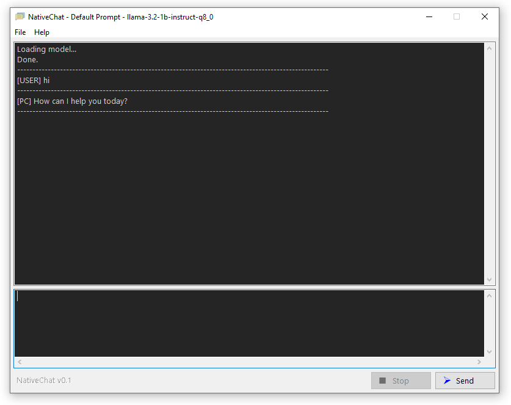
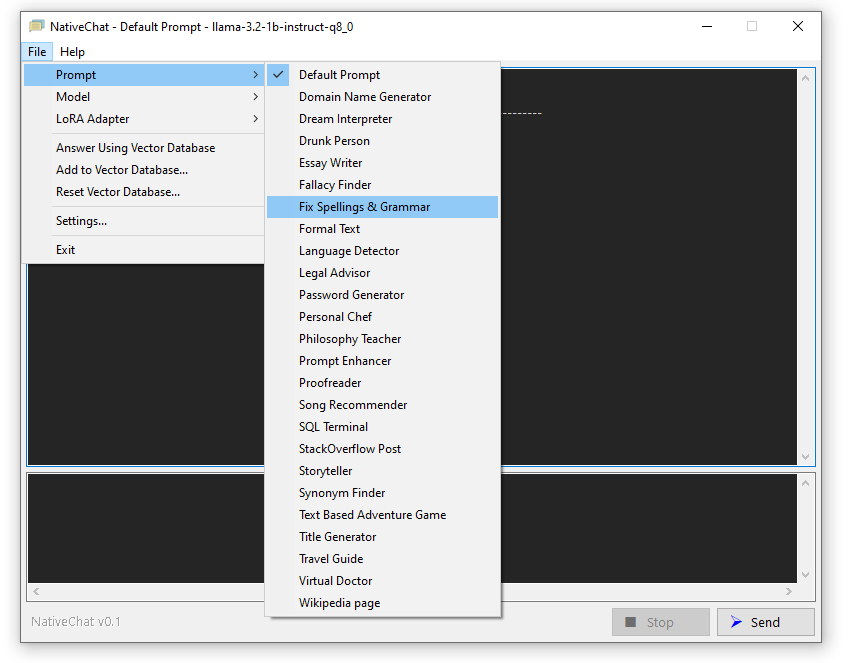

# NativeChat  

**NativeChat** is a simple, native frontend for **llama-cli**. It redirects the console input and output of llama-cli into a gui interface.

[Download from here...](https://github.com/hasaranga/NativeChat/releases)

## Installation

1. **Install C++ Runtime**:  
   Locate and install the C++ runtime in the `redist` directory (`VC_redist 2015-2022.x64.exe`).

2. **Download Required Models**:  
   Download the necessary GGUF models from [Hugging Face](https://huggingface.co/) and place them in the `models` directory. ([qwen2.5-0.5b-instruct-q5_k_m.gguf](https://huggingface.co/Qwen/Qwen2.5-0.5B-Instruct-GGUF/resolve/main/qwen2.5-0.5b-instruct-q5_k_m.gguf?download=true))

## Usage

1. Run `NativeChat.exe`.
2. Select the required model and prompt.  
   - When changing the model or prompt, the program will restart automatically.  
   - To run another instance, simply execute the program again.

3. Once the model is loaded, the **Send** button will become active.  
   - The lower text area allows you to send input to the model.
   - The upper text area displays the model's response.

## LoRA Adapters

NativeChat supports single model with various LoRA adapters rather than needing fine-tuned models for each task. To utilize adapters:

1. Use the `convert_lora_to_gguf.py` script from llamacpp to convert the adapter into a GGUF file.
2. Place this adapter GGUF file in the `adapters` directory.
3. In the `adapters` directory, create a UTF-8 text file named after your model (e.g., `"your_model".txt`).
4. List the adapter file names intended for use with that model in the text file, separated by new lines (`\r\n`).

## Text Embeddings Feature

1. Download [nomic-embed-text-v1.5.Q8_0.gguf](https://huggingface.co/nomic-ai/nomic-embed-text-v1.5-GGUF/resolve/main/nomic-embed-text-v1.5.Q8_0.gguf?download=true) and place it in the program directory.
2. Create a UTF-8 formatted text file containing the knowledge data, with each paragraph separated by `\r\n\r\n`.
3. Import this text file into the vector database using the **Add to Vector Database** option.
4. Enable the **Answer Using Vector Database** option to utilize embedded text responses.

## Additional Options

- **Show Initialization**: To view the system prompt on loading, enable the "Show Initialization" option in the settings.

- **Using CUDA for Improved Performance**:  
   For larger models or improved inference speed, replace the following files with their [CUDA-equivalent versions](https://github.com/ggerganov/llama.cpp/releases). By default, supplied files only utilize the CPU, allowing simple models to run on older systems.
   - `ggml.dll`
   - `llama.dll`
   - `llama-cli.exe`
   - `llama-embedding.exe`

## Troubleshooting

- If the program fails to load or crashes, delete the `settings.cfg` file.
- Use Task Manager to terminate any non-responsive `llama-cli.exe` processes.

## Portability

NativeChat is portable. You can run multiple instances from different folders independently.
